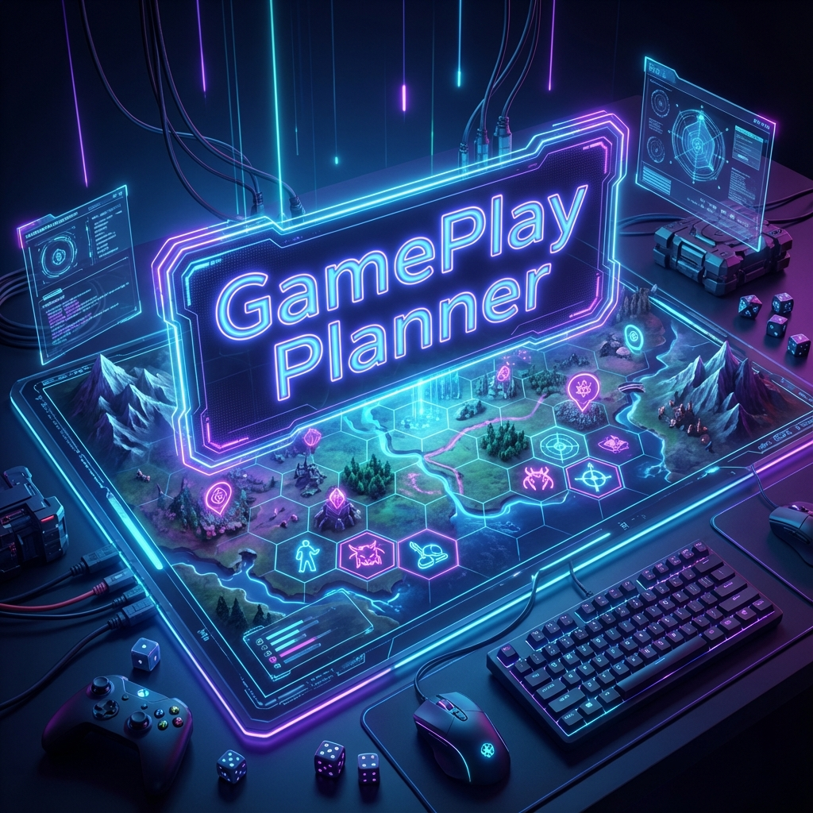
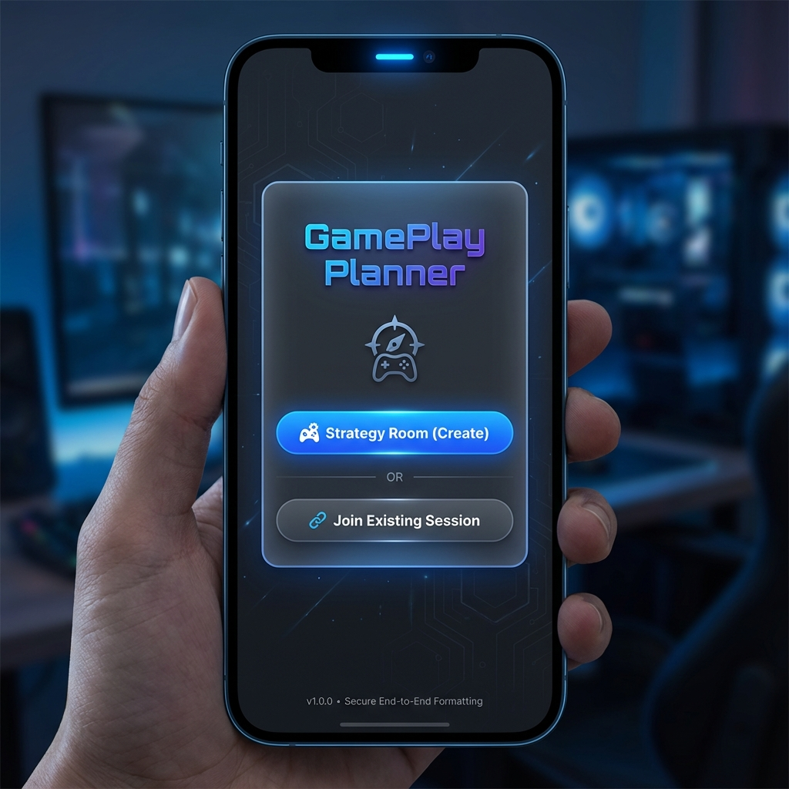
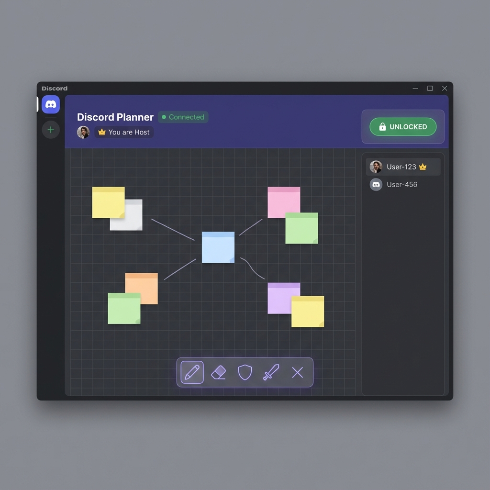
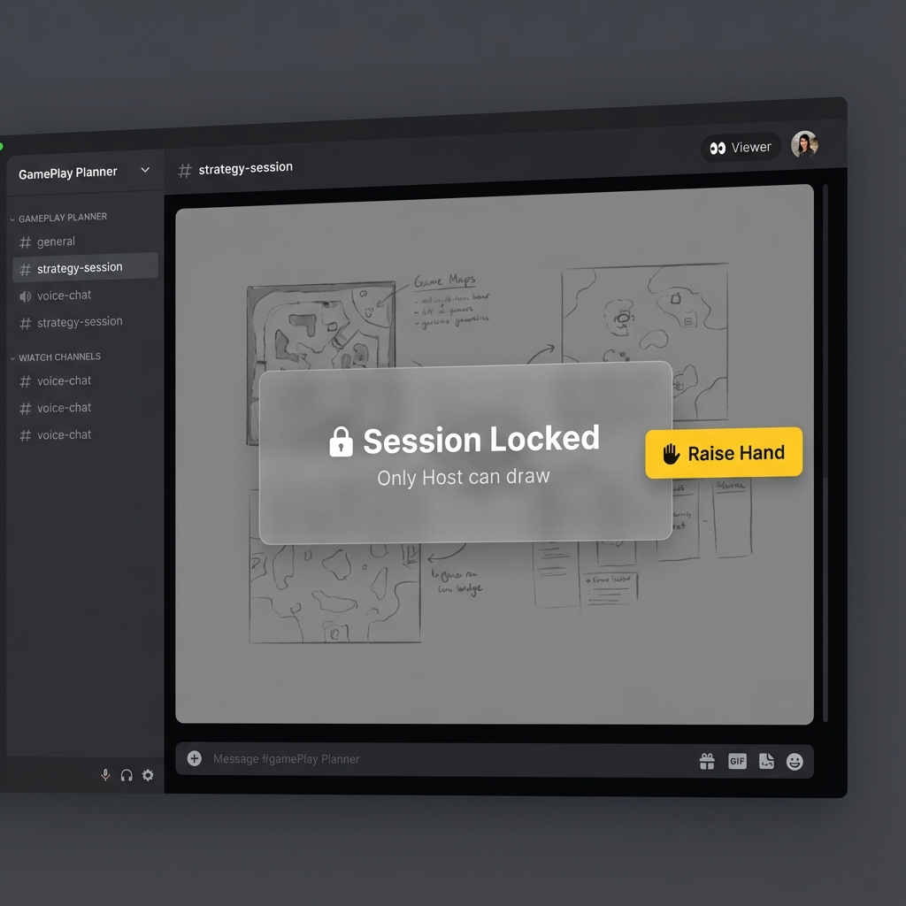

# GamePlay Planner 🛡️⚔️



**GamePlay Planner** is a real-time, collaborative tactical whiteboard designed specifically for Discord Activities. It enables gaming communities to plan raids, strategies, and map movements seamlessly within Discord voice channels.

## 🚀 Features

*   **Real-Time Collaboration**: Built with `Yjs` and `WebSockets`, changes are synced instantly across all users.
*   **Dynamic Sessions**:
    *   **Landing Screen**: Create or Join sessions instantly.
    *   **Dual Mode**: Works inside Discord (Embedded) AND as a standalone Web App (GitHub Pages).
    *   **Session Codes**: Shareable 6-character codes (e.g., `X7K9P`).
    *   **Multiple Rooms**: Support for multiple concurrent strategy sessions.
*   **Tactical Whiteboard**:
    *   Powered by `tldraw`.
    *   **Custom RPG Toolkit**: Drag-and-drop icons (Tank, Healer, DPS, Flags, Boss Skulls).
    *   **Map Upload**: Drop your dungeon maps directly onto the board.
*   **Host & Role Management**:
    *   **Panic Button (Lock)**: The Host can lock the board to prevent chaos.
    *   **Hand Raise System**: Viewers can request permission to draw when the session is locked.
    *   **Host Transfer**: Pass leadership to another player.
*   **Discord Integration**: Native look and feel with dark mode interactions.

## 📸 Gallery

### Landing Screen
*Create a new room or join your team.*


### Host View (Unlocked)
*Full control over the board and participants.*


### Viewer Perspective (Locked)
*Clear feedback when the session is paused by the host.*


### 🌍 Web Version (GitHub Pages)
*The independent web version runs in any browser.*

**Commander Identification**
*Since there is no Discord Auth, users identify themselves manually.*


**Browser Experience**
*Full features available in Chrome, Firefox, Safari, etc.*


## 🛠️ Installation & Development

### Prerequisites
*   Node.js (v18+)
*   Discord Account (Developer Mode enabled)

### Local Development
1.  **Clone the repo**:
    ```bash
    git clone https://github.com/your-username/discord-gameplay-planner.git
    cd discord-gameplay-planner
    ```

2.  **Install dependencies**:
    ```bash
    npm install
    ```

3.  **Start the Signaling Server (Y-Websocket)**:
    Required for multiplayer functioning locally.
    ```bash
    npx y-websocket
    ```

4.  **Start the App**:
    ```bash
    npm run dev
    ```

5.  **Open in Browser**:
    Visit `http://localhost:5173`. Open multiple tabs to test sync!

### Discord Integration (Tunneling)
To test inside Discord:
1.  Start a Cloudflare Tunnel: `cloudflared tunnel --url http://localhost:5173`
2.  Paste the URL into the **Discord Developer Portal > Activities > URL Mappings**.
3.  Launch the activity in a Voice Channel.

## 📚 Documentation
For detailed guides, please refer to:
*   [**Manual de Integración en Discord**](public/manuals/manual_integracion_discord.md) - How to register and publish the app.
*   [**Manual Testing**](public/manuals/manual_testing.md) - Testing strategies (Local vs Integrated).
*   [**Manual Versión Web (GitHub Pages)**](public/manuals/manual_web_deployment.md) - How to deploy as a standalone website.

## 📄 License
MIT License